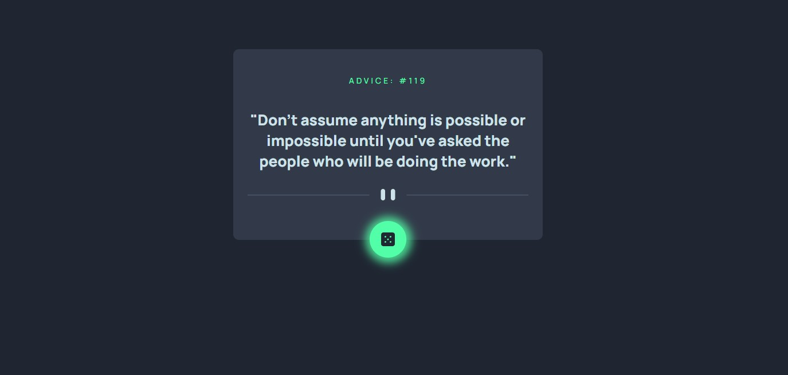

# Frontend Mentor - Advice generator app solution

This is my solution to the [Advice generator app challenge on Frontend Mentor](https://www.frontendmentor.io/challenges/advice-generator-app-QdUG-13db). 
## Table of contents

- [Overview](#overview)
  - [The challenge](#the-challenge)
  - [Screenshot](#screenshot)
  - [Links](#links)
- [My process](#my-process)
  - [Built with](#built-with)
  - [What I learned](#what-i-learned)
  - [Continued development](#continued-development)
  - [Useful resources](#useful-resources)
  - [AI Collaboration](#ai-collaboration)
- [Author](#author)

## Overview

### The challenge

Users should be able to:

- View the optimal layout for the app depending on their device's screen size
- See hover states for all interactive elements on the page
- Generate a new piece of advice by clicking the dice icon

### Screenshot



See above a picture of my solution on the active state. The dice icon is a hover state

### Links

- Solution URL: [Add solution URL here](https://github.com/tchock42/advice-generator)
- Live Site URL: [Add live site URL here](https://advice-generator-jgc.netlify.app/)

## My process

### Built with

- Semantic HTML5 markup
- CSS custom properties
- Flexbox
- CSS Grid
- Mobile-first workflow
- [React](https://reactjs.org/) - JS library


### What I learned

I an a little rusted in React and I'm still learning how to use it effectively. I use this project to practice custom hooks and hooks like useState and useEffect.
I like the idea of using ternary operators in my code. I'm still learning how to use them effectively, so I'll be working on it.


```js
{spinner && <Spinner/>}
{hasAdvice && `"${advice.slip.advice}"`}
{notFound && "Sorry, advice service no available"}
```


### Continued development

My next steps will be to improve my skills by working on more complex projects and learning new techniques. I'll also be working on improving my understanding of React and later I want to make an app that works in backend with node.js o laravel and in the frontend with react.

### Useful resources

- [Example resource 1](https://https://cssloaders.github.io/) - This helped me for adding a simple spinner for my loading state.
- [Example resource 2](https://https://html-css-js.com/css/generator/box-shadow/) - This helped me to create the shadow effect for my dice button.

### AI Collaboration

I tried to implement AGENTS.md with my ollama tool so it helps me to improve my coding skills insted of let AI doing the job for me.

## Author

- Website - [Jacob Gómez](https://wwww.github.com/tchock42)
- Frontend Mentor - [@tchock42](https://www.frontendmentor.io/profile/tchock42)
